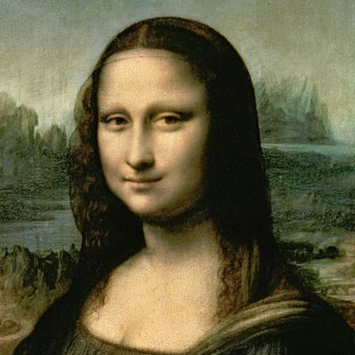
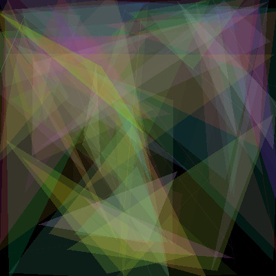
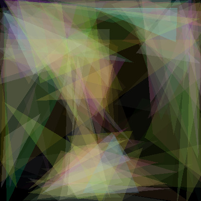
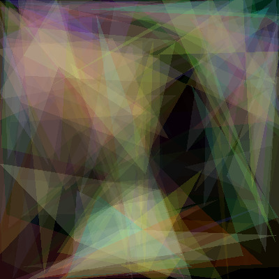

# GeneDraw

An evolutionary based genetic algorithm that generates an image that resembles a target image using polygons.

### Prerequisites

- python3
- Pillow

```
    pip3 install Pillow
```

## Running

```
    python genedraw.py <target_image>
```

## About the project
An individual is made using a number of polygons. You can change the number of polygons in each invidual and the maximum number of vertices that each polygon has in the parameters file.

At first, a generation containing random individuals is generated. Afterwards, at each iteration, the fitness is calculated for each member of the population and a crossover happens in one of two ways:
- delete the worst members of the population and then mate the two best ones(take half the genome of each one or randomly mix genes from both)
- for a count of the population, replace the individuals with genes of the parents(without deleting or adding new members)

The second method is from the Github page I put in the Acknowledgements part. I did multiple tests and they both converge just as well.


### Original


### First iteration


### Using only triangles


### Using multiple vertices in each polygon



## Authors

* **Alexandru Meterez**

## License

This project is licensed under the MIT License.

## Acknowledgments
Inspired from **Peter Braden** - https://github.com/peterbraden/genetic-lisa
